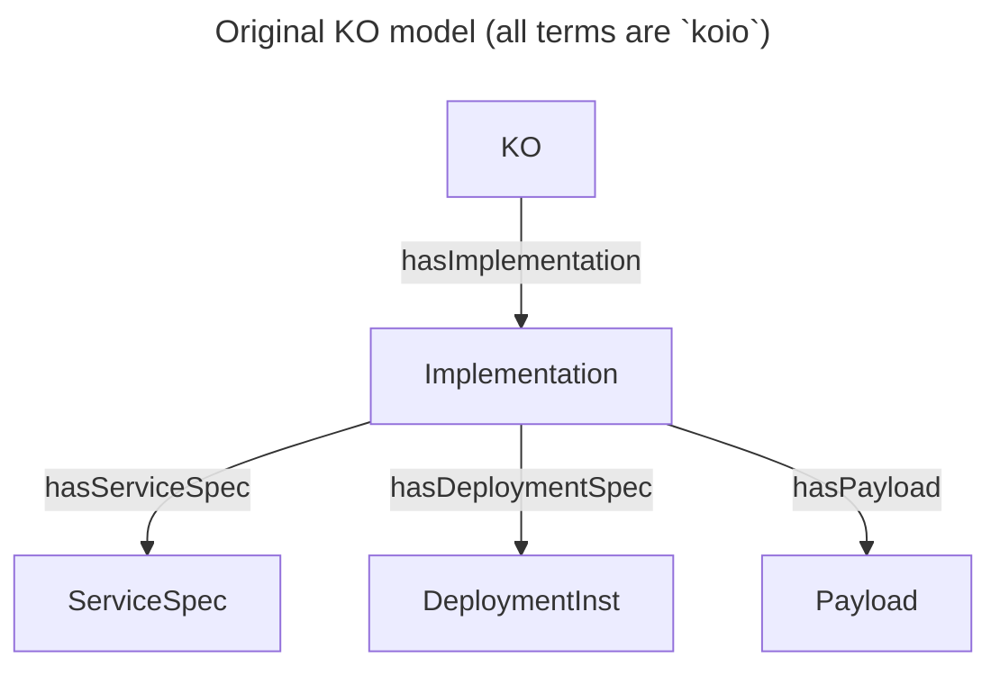
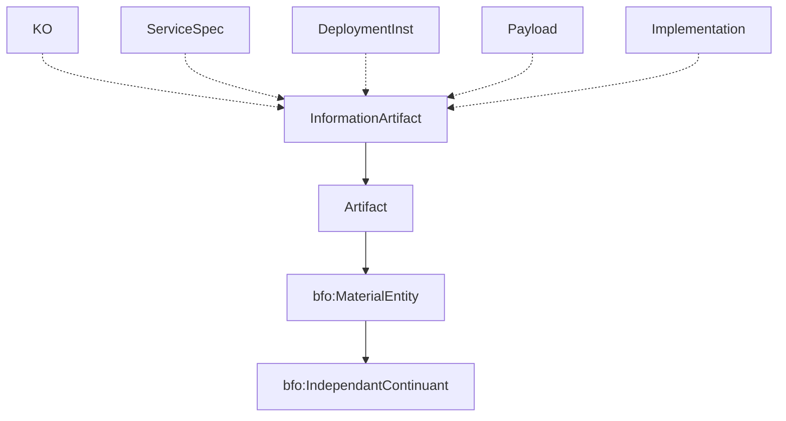
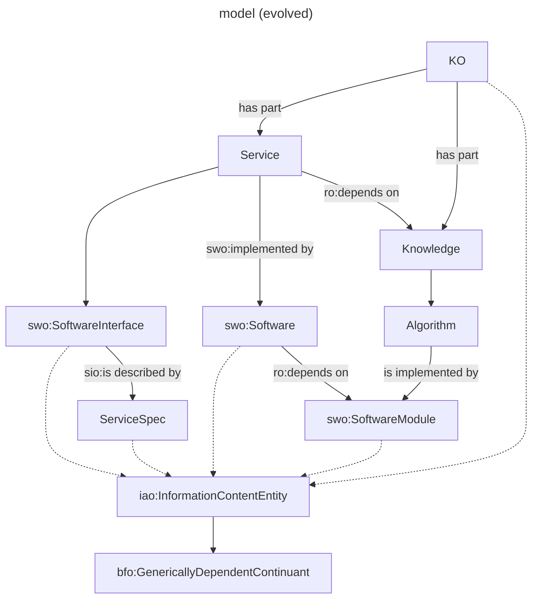
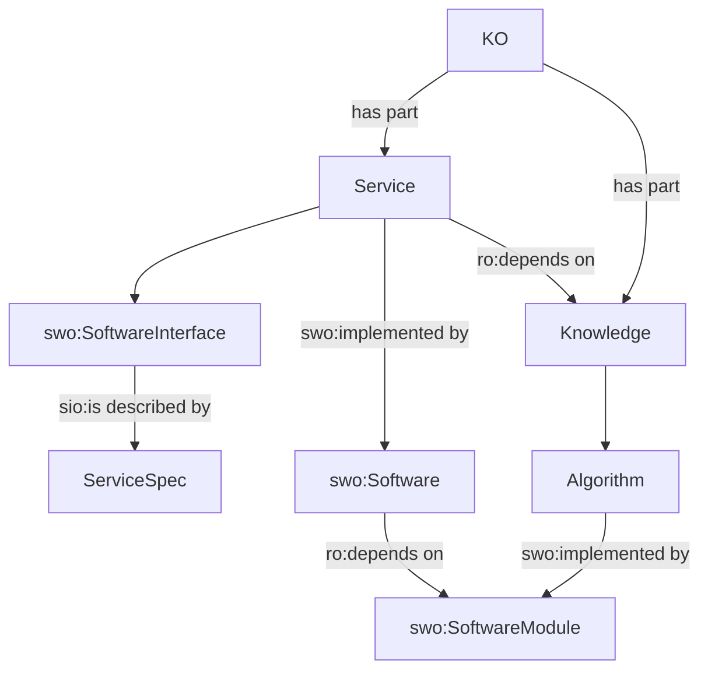
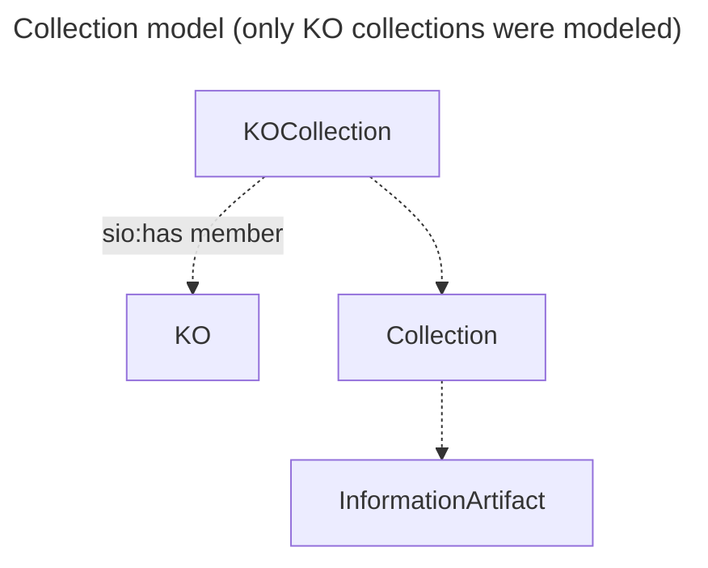
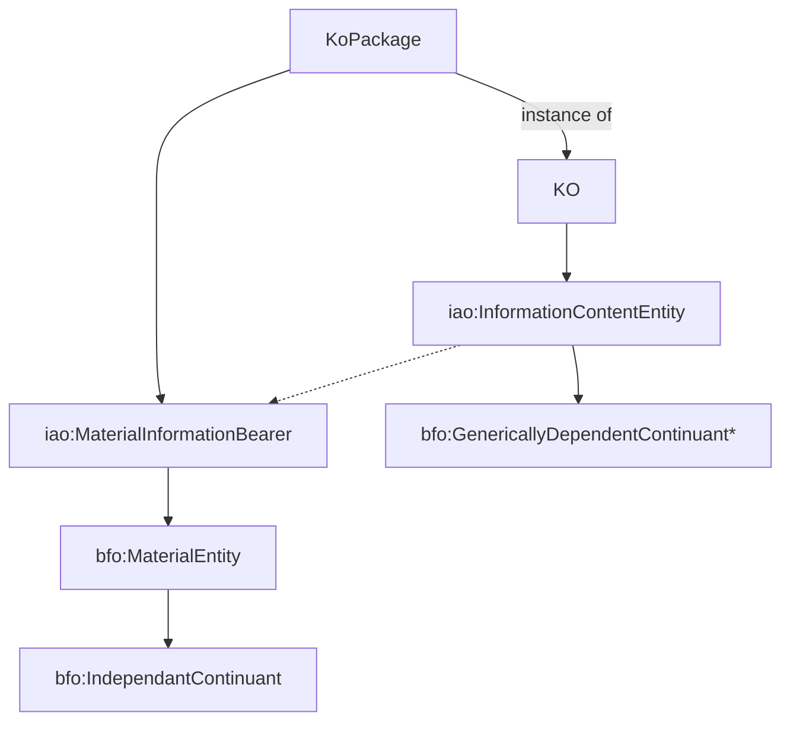

## Model evolution


### Notes
Predicates like `has...` in `koio` are of type `koio:hasPart` which is a `bfo:TranstiveProperty` and have inverses defined, e.g. `isPartOf...`. However `dcterms` also defines a `dcterms:Relation` called `dcterms:hasPart`, the RO relations ontology defines `ro:hasPart` and `ro:partOf`, etc., if we don't want to create our own definition.

The `hasServiceSpec` predicate seems to imply that the `Implementation` is a `Service` or provides a `Service`, but the `Service` term is not defined. But since the type of the predicate is `koio:hasPart` we can only surmise that the `ServiceSpec` is "part of' the `Implementation`. Similar questions arise with `DeploymentInst`. In addition, the implication is that `Payload` is part of the `Implementation` but it is not clear that the three `has...` predicates exhaustively relate the parts of the `Implementation`.

(BTW, `Implementation` is not used in any of our existing KOs.)

Finally the major entities in the model all derive from `bfo:MaterialEntity`:



However, many or most of the terms of interest in the evolving model (found in the IAO and SWO) are of type `iao:InformationContentEntity` (derived from `bfo:GenericallyDependentContinuant`). These are terms like `swo:SoftwareInterface`, `swo:Licence`, `iao:Algorithm`, `iao:SoftWareModule`, etc. Without a realignment to `iao:InformationContentEntity` we cannot say things like:

----


----
BTW, modeling `Service` as a `swo:SoftwareInterface` allows for rich and nuanced description in the context of CBK. See [wiki:API](https://en.wikipedia.org/wiki/API), esp. *Examples* and *See Also* sections for an idea of the variety of interaction models. The subclass tree is potentially quite large but among those types initially mentioned in the SWO for `swo:SoftwareInterface` are:

#### software interface (9)
- application programming interface
- command-line interface
- graphical user interface (2)
  - desktop graphical user interface
  - web user interface
- web service (3)
  - JSON web service
  - REST service
  - SOAP service

----



----

### Notes

#### koio

KOIO is an ontology describing Knowledge Objects and their parts as they are implemented in the Knoweldge Grid (KGrid) reference platform.  As such, KOIO is subject to evolve as KGrid reference platform development evolves.

The primary overriding objective of developing and implementing KOIO is to describe Knowledge Objects and their parts in enough detail to achieve a degree  interoperability that is sufficient to enable Knowledge Objects to be incorporated into multiple platforms, including but not limited to, the KGrid reference platform

With the exception of several upper level classes from BFO and IAO, KOIO versions 1.X.X are limited to classes of material entities spanning Knowledge Objects, parts of Knowledge Objects, and Collections of Knowledge Objects.

KOs and their parts are classed as ***material entites*** but see [Basic Formal Ontology: Case Studies](https://philarchive.org/archive/OTTBBF) for an argument for KOs and their constituent parts as ***information content entities*** whose particular instances are born by a ***information bearing entity*** which is a ***material entity***

>generically dependent continuant – an entity that exists in virtue of the fact that there is at least one of what may be multiple copies; it is the content or the pattern that the multiple copies share.- 


#### Metadata Types
There are three main types of metadata: descriptive, administrative, and structural.

* Descriptive metadata enables discovery, identification, and selection of resources. It can include elements such as title, author, and subjects.

* Administrative metadata facilities the management of resources. It can include elements such as technical, preservation, rights, and use.

* Structural metadata, generally used in machine processing, describes relationships among various parts of a resource, such as chapters in a book.

### Terms
We are going to play with the [SWO](https://www.ebi.ac.uk/ols/ontologies/swo/terms?iri=http%3A%2F%2Fpurl.obolibrary.org%2Fobo%2FIAO_0000064&lang=en&viewMode=All&siblings=true), IAO, and [SIO (especially for software entity relationships: library, module, method)](https://www.ebi.ac.uk/ols/ontologies/sio/terms?iri=http%3A%2F%2Fsemanticscience.org%2Fresource%2FSIO_000098&lang=en&viewMode=All&siblings=true)

#### implements, isImplementedBy

a software module implements an algorithm, an algorithm isImplementBy a software module

```mermaidx
graph TB
  swo:SoftwareInterface --exposes--> swo:Algorithm
  swo:SourceCodeModule --is a--> PlanSpecification
  swo:SoftwareInterface --is a--> DirectiveInformationEntity
  
  swo:Algorithm --is implemented by--> swo:SourceCodeModule
  swo:SoftwareInterface --is implemented by--> swo:SourceCodeModule

  DirectiveInformationEntity --is a--> InformationContentEntity 
  PlanSpecification --is a--> DirectiveInformationEntity
```
----
#### Using [SIO](https://www.ebi.ac.uk/ols/ontologies/sio/terms?iri=http%3A%2F%2Fsemanticscience.org%2Fresource%2FSIO_000098&lang=en&viewMode=All&siblings=true) terms

```mermaidx
graph TB
  koio:KO --aggregates--> koio:Knowledge & koio:Service

  koio:Knowledge --is a--> 
  swo:Algorithm --is implemented by-->
  sio:SoftwareMethod 

  koio:Service --is a-->
  swo:SoftwareInterface --is implemented by-->
  sio:SoftwareModule --has member-->
  sio:SoftwareMethod


  sio:SoftwareMethod --is a--> sio:SoftwareEntity --is a--> sio:ComputationalEntity --is a-->InformationContentEntity 
  sio:SoftwareModule --is a--> sio:SoftwareEntity
  swo:SoftwareInterface --is a--> DirectiveInformationEntity

```


## Questions

* What does a knowledge object look like when the KO, the service/interface, and the implementation are separate? What if the "knowledge" implementation and the service implementation were different.
* What about a batch application and a web API in the same KO?

## Submodels


----

We could probably just use `skos:Collection` and `skos:hasMember`

## Appendix A—relationship between generic

[Basic Formal Ontology: Case Studies](https://philarchive.org/archive/OTTBBF)

>Many of the cases involve information. An information content entity is a generically dependent continuant that is about some entity. The term originates in the Information Artifact Ontology (IAO), an ontology that extends BFO. Because information content entity is a direct subclass of generically dependent continuant, an information content entity may generically depend on one or more material entities. One example is the content of a novel may be concretized by patterns of ink in multiple physical books or may be concretized by the digital patterns in different network servers; when this occurs, the novel (an information content entity) then generically depends on the physical books and network servers.

>Although it is possible to define a subclass of information content entity as always having a unique serialization (e.g. as in the case of an International Standard Book Number ISBN, which would have a unique serialization such as “978-0-393-28857-5”), it is preferable in many cases to track information that can be common across serializations or translations, much as a proposition may be expressed by different sentences. One way to enable this is to treat the serialization as a property of the bearer of the information content entity, rather than the information content entity itself. To illustrate, Figure 3 depicts a measurement information content entity, its subject (an instance of process of walking), a material entity, and the measurement unit and string associated with that material entity. If the measurement information content entity was converted to kilometers, the instance of information content entity would remain the same, but would now also generically depend on a distinct instance of information bearing entity that would have text value “3.22 kilometers per hour”. Preliminaries in hand, we turn to the formalization of cases.



We have learned that the KO is not the packaged KO; there are multiple potential ways of packaging a KO for various uses.  


We still have to work out the identity of the `iao:InformationContentEntity` vs. the `iao:MaterialInformationBearer`

\* generically dependent continuant – an entity that exists in virtue of the fact that there is at least one of what may be multiple copies; it is the content or the pattern that the multiple copies share.