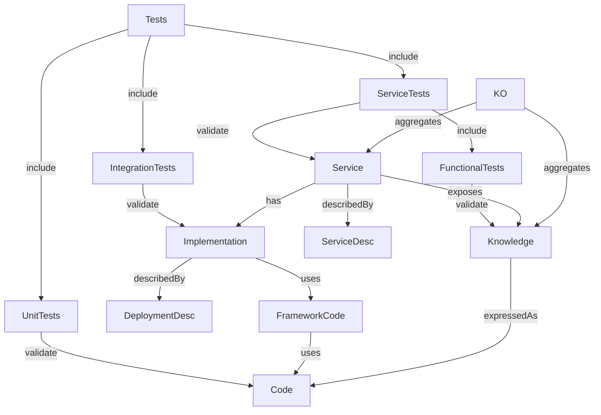

```mermaid
graph TD
KO -->|aggregates| Knowledge
KO -->|aggregates| Service

Knowledge --> |expressedAs| Code

Implementation --> |uses| FrameworkCode 
Implementation --> |describedBy| DeploymentDesc
FrameworkCode --> |uses| Code

Service --> |has| Implementation
Service --> |describedBy| ServiceDesc
Service --> |exposes| Knowledge

Tests --> |include| UnitTests & ServiceTests & IntegrationTests
UnitTests --> |validate| Code
ServiceTests --> |validate| Service
IntegrationTests --> |validate| Implementation
ServiceTests --> |include| FunctionalTests
FunctionalTests --> |validate| Knowledge

```
