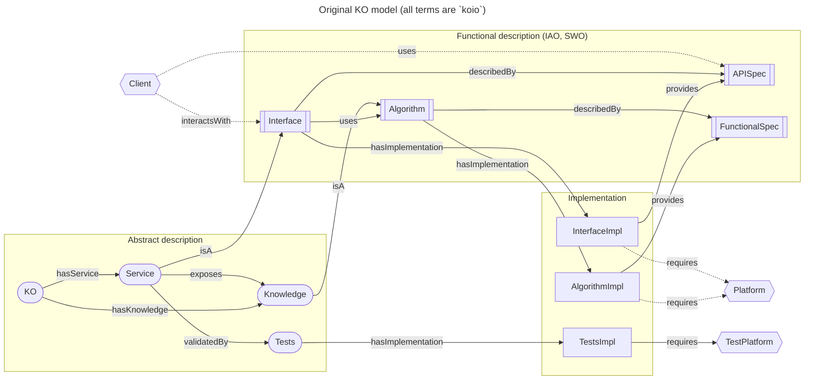

```mermaid
---
title: Original KO model (all terms are `koio`)
---
graph LR

Platform{{Platform}}
TestPlatform{{TestPlatform}}
Client{{Client}}

subgraph Abstract description
KO([KO])
Service([Service])
Knowledge([Knowledge])
Tests([Tests])
end

subgraph "Functional description (IAO, SWO)"
Algorithm[[Algorithm]]
Interface[[Interface]]
APISpec[[APISpec]]
FunctionalSpec[[FunctionalSpec]]
end 

subgraph "Implementation"
InterfaceImpl
AlgorithmImpl
TestsImpl
end

Client -.->|interactsWith| Interface
Client -.->|uses| APISpec

KO --hasService--> Service 
Service --exposes--> Knowledge
KO --hasKnowledge--> Knowledge
Service --isA--> Interface
Knowledge --isA--> Algorithm
Service --validatedBy--> Tests

Interface --hasImplementation--> InterfaceImpl 
Interface --uses--> Algorithm
Interface --describedBy--> APISpec
Algorithm --describedBy--> FunctionalSpec
Algorithm --hasImplementation--> AlgorithmImpl
Tests --hasImplementation--> TestsImpl

InterfaceImpl -.->|requires| Platform
InterfaceImpl --provides--> APISpec
AlgorithmImpl -.->|requires| Platform
AlgorithmImpl --provides--> FunctionalSpec
TestsImpl --requires--> TestPlatform

```
