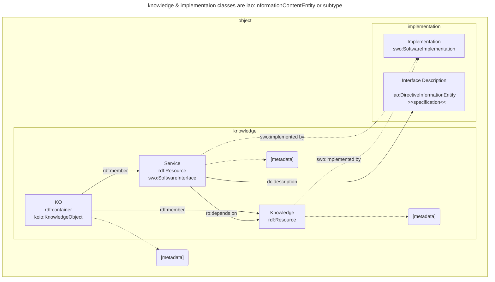
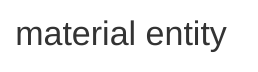

```mermaid
---
title: knowledge & implementaion classes are iao:InformationContentEntity or subtype
---
graph
KO[
    KO
    rdf:container
    koio:KnowledgeObject
  ]
S[Service
          rdf:Resource
          swo:SoftwareInterface
          ] 
K[
    Knowledge
    rdf:Resource
  ]
subgraph object
KO -.-> m1("[metadata]")
  subgraph knowledge
  KO --rdf:member
    --> S
  S -- ro:depends on --> K
  KO -- rdf:member
  --> K
  K -.-> m("[metadata]")
S -.-> m2("[metadata]")
  end
  subgraph implementation
    K -.swo:implemented by.-> I
    S --dc:description--> SD[Interface Description
    iao:DirectiveInformationEntity
    >>specification<<]
    S -.swo:implemented by.-> I[Implementation\nswo:SoftwareImplementation]
  end
end
```

```mermaid
---
title: material entity
---

graph 

```
